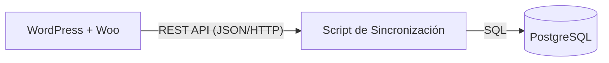

# Arquitectura de Integración: WP + Woo + Postgres

En un entorno normal, WordPress usa **MySQL/MariaDB**. Nuestra meta es extraer datos de ahí y llevarlos a **PostgreSQL** para análisis o aplicaciones externas.

## El Flujo de Datos

## ¿Por qué no conectar Postgres directamente a WordPress?
WordPress no soporta PostgreSQL nativamente de forma estable. Por eso usamos la **REST API** como puente.

### Ventajas de este modelo:
1. **Desacoplamiento:** Si WordPress falla, tus datos en Postgres siguen seguros.
2. **Rendimiento:** Las consultas pesadas de reportes se hacen en Postgres, sin ralentizar tu tienda online.
3. **Escalabilidad:** Puedes usar Postgres para alimentar una App móvil o un Dashboard de IA sin tocar la base de datos de WordPress.

## ¿Qué datos sincronizar?
En este proyecto priorizamos:
- **Productos:** SKU, Precios, Stock.
- **Pedidos:** Totales, Estados, Fechas.
- **Clientes:** Nombres, Emails (respetando privacidad).
